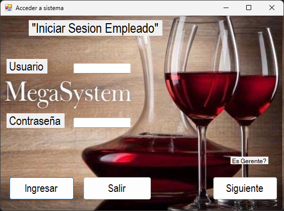

# 🧮 Proyecto - MegaSystem

Un sistema de información y de control de información que tiene los siguientes módulos:

Características:

Inventario
- Captura los proveedores de cada producto.
- Visualización de proveedores.
- Permite modificar y eliminar proveedores.
- Consulta la información que se ingresa en inventario.
- Registra los productos del inventario.
- Permite modificar datos de la tabla inventario.
- Permite eliminar datos de la tabla inventario. 

Ventas
- Muestra las ventas diarias.
- Registra una orden por medio de consultas, insertar y eliminar datos.
- Consulta la suma de las ventas diarias.
- Elimina o modifica productos del menú.
- Captura productos del menú.

Empleados
- Captura la información básica de los empleados.
- Permite consultar la información de los empleados.
- Modificar y eliminar información de los empleados existentes.
- Reconoce quien accedió al sistema (por medio de una password).

---

## 📷 Captura del Programa

---

## 🛠 Tecnologías usadas

- C# (.NET Framework)
- Windows Forms
- Base de datos Access (No es BD es un guardado de datos solamente pero ahora la simulación de una BD)

---

## 🚀 Cómo ejecutar

1. Abre el proyecto con Visual Studio
2. Compila y ejecuta (F5)
3. Debes abrir Access de Office y ver como esta estructura las tablas
4. Puedes los Insert, Update, Delete, Select

---

## ✍️ Autor

- Carlos Alberto Medina Beltran
